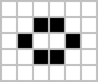

# Conway's Game of Life
The Game of Life, also known simply as Life, is a cellular automaton devised by the British mathematician John Horton Conway in 1970. It is a zero-player game, meaning that its evolution is determined by its initial state, requiring no further input. One interacts with the Game of Life by creating an initial configuration and observing how it evolves. It is Turing complete and can simulate a universal constructor or any other Turing machine. 

## Rules
The universe of the Game of Life is an infinite, two-dimensional orthogonal grid of square cells, each of which is in one of two possible states, live or dead (or populated and unpopulated, respectively). Every cell interacts with its eight neighbours, which are the cells that are horizontally, vertically, or diagonally adjacent. At each step in time, the following transitions occur:

    1. Any live cell with fewer than two live neighbours dies, as if by underpopulation.
    2. Any live cell with two or three live neighbours lives on to the next generation.
    3. Any live cell with more than three live neighbours dies, as if by overpopulation.
    4. Any dead cell with exactly three live neighbours becomes a live cell, as if by reproduction.

These rules, which compare the behavior of the automaton to real life, can be condensed into the following:

    1. Any live cell with two or three live neighbours survives.
    2. Any dead cell with three live neighbours becomes a live cell.
    3. All other live cells die in the next generation. Similarly, all other dead cells stay dead.

The initial pattern constitutes the seed of the system. The first generation is created by applying the above rules simultaneously to every cell in the seed, live or dead; births and deaths occur simultaneously, and the discrete moment at which this happens is sometimes called a tick. Each generation is a pure function of the preceding one. The rules continue to be applied repeatedly to create further generations. 

## Example Patterns
Many different types of patterns occur in the Game of Life, which are classified according to their behaviour. Common pattern types include: still lifes, which do not change from one generation to the next; oscillators, which return to their initial state after a finite number of generations; and spaceships, which translate themselves across the grid.

The earliest interesting patterns in the Game of Life were discovered without the use of computers. The simplest still lifes and oscillators were discovered while tracking the fates of various small starting configurations using graph paper, blackboards, and physical game boards, such as those used in Go. During this early research, Conway discovered that the R-pentomino failed to stabilize in a small number of generations. In fact, it takes 1103 generations to stabilize, by which time it has a population of 116 and has generated six escaping gliders; these were the first spaceships ever discovered.

Frequently occurring examples (in that they emerge frequently from a random starting configuration of cells) of the three aforementioned pattern types are shown below, with live cells shown in black and dead cells in white. Period refers to the number of ticks a pattern must iterate through before returning to its initial configuration. 

|  | Still Lifes |  |  | Oscillators |  | | Spaceships |
| :----: | :---: | :---: | :---: | :---: | :---: | :---: | :---: |
| Block |  |  | Blinker (period 2) |  |  | Glider |  |
| Bee-hives |  |  | Toad (period 2) |  |  | Light-weight Space Ship |  |
| Loaf |  |  | Beacon (period 2) |  |  | Middle-weight Space Ship |  | 
| Boat |  |  | Pulsar (period 3) |  |  | Heavy-weight Space Ship |  |
| Tub |  |  | Penta-decathlon (period 15) |  |

## Installation

### Requirements
Made using TypeScript and React
```
node v16.16.0
npm 8.11.0
```
1. Install node and npm and make sure they are updated. Application does not work for versions of node v14.00.0 and below.
2. Clone repository: ```git clone https://github.com/noumxn/GameOfLife.git```
3. Run ```npm start``` and you're all set!